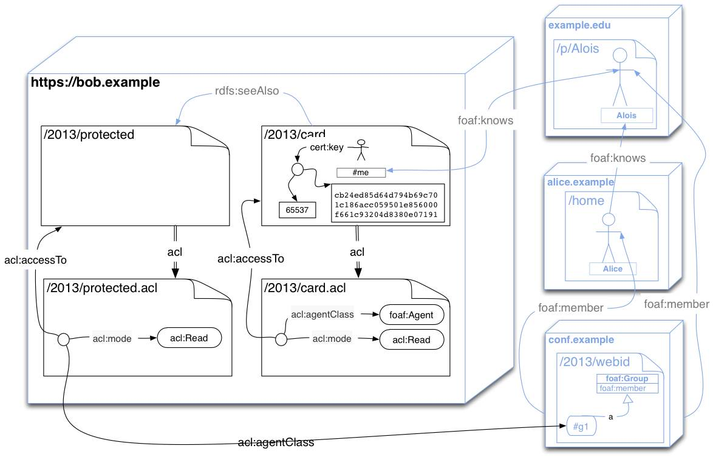

rww-play 
========

This is an implementation in Play of a number of tools to build a Read-Write-Web server using Play2.x and akka.
It is very early stages at present and it implements sketches of the following

* A [CORS](http://www.w3.org/TR/cors/) proxy
* An initial implementation of [Linked Data Basic Profile](http://www.w3.org/2013/ldp/wiki/Main_Page)

This currently works in the [TLS branch of the bblfish fork of Play 2.x](https://github.com/bblfish/Play20), which comes with TLS support and a few more patches.

We use [Travis CI](http://travis-ci.org/) to verify the build: [](http://travis-ci.org/read-write-web/rww-play)


Getting going
-------------


* You need Java 7 at least - the official Oracle JVM or another one based on [the GPLed code](http://openjdk.java.net/): removing the dependency on Oracle's JVM will require [publishing of the GPLed java security libs](http://stackoverflow.com/questions/12982595/openjdk-sun-security-libs-on-maven)
* clone [this project](https://github.com/read-write-web/rww-play) 

```bash
 $ git clone git://github.com/read-write-web/rww-play.git 
``` 
### The short version

In the _rww-play_ home directory, run the `build` bash script. It will download a precompiled tuned 
version of play, build the application, and run it. (If there is no remotely downloadable version
it will build it from source in the `Play20` directory.)

```bash
$ ./build
```

You can then run _rww-play_ with all the right options just by executing `run` on the command line:

```bash
$ ./run
```

### The longer version

Compile the [bblfish's TLS branch of Play 2.0](https://github.com/bblfish/Play20) that is available as a [submodule](http://git-scm.com/book/en/Git-Tools-Submodules) in the cloned repository as follows:

```
 $ git submodule init
 $ git submodule update
 $ cd Play20/framework
 $ ./build
 > publish-local 
  ... [exit scala shell]
 $ cd ../..
```

* From the home directory of this project, start the previously compiled Play2.0 server you can run play on `http` port 9000 [TODO: Currently RWWPlay won't work correctly with non TLS Ports, as it uses client certificates for auth]

```bash
$ Play20/play
> run
```

* to start Play in secure mode with lightweight client certificate verification (for WebID)

```bash
 $ Play20/play
 > run  -Dhttps.port=8443 -Dhttps.trustStore=noCA
```

* You can also start the server so that it only accepts WebID certificates - which we will currently
 assume are those signed by an agent named "CN=WebID,O=∅". This is experimental! The previous solution is recommended.

```bash
 $ Play20/play
 > run  -Dhttps.port=8443 -Dhttps.trustStore=webid.WebIDTrustManager
```


## Web Access Controled Linked Data

An initial implementation of the [Linked Data Platform](http://www.w3.org/2013/ldp/hg/ldp.html) spec is implemented here. 
The same way as the [Apache httpd server](http://httpd.apache.org/) it servers resource from the file system and maps
them to the web. 
By default we map the `test_www` directory's content to [http://localhost:8443/2013/](http://localhost:8443/2013/).

The test_www directory starts with a few files to get you going

```bash
$ cd test_www
$  ls -al 
total 48
drwxr-xr-x   4 hjs  admin   340  9 Jul 19:04 .
drwxr-xr-x  15 hjs  admin  1224  9 Jul 19:04 ..
-rw-r--r--   1 hjs  staff   229  1 Jul 08:10 .acl.ttl
-rw-r--r--   1 hjs  admin   109  9 Jul 19:04 .ttl
lrwxr-xr-x   1 hjs  admin     8 27 Jun 20:29 card -> card.ttl
-rw-r--r--   1 hjs  admin   167  7 Jul 22:42 card.acl.ttl
-rw-r--r--   1 hjs  admin   896 27 Jun 21:41 card.ttl
-rw-r--r--   1 hjs  admin   102 27 Jun 22:32 index.ttl
drwxr-xr-x   2 hjs  admin   102 27 Jun 22:56 raw
drwxr-xr-x   3 hjs  admin   204 28 Jun 12:51 test
```

All files with the same initial name up to the `.` are considered to work together,
(and in the current implementation are taken care of by the same agent).

Symbolic links are useful in that they:
 - allow one to write and follow linked data that works on the file system without needing to name files by their extensions. For example
following the relation `foaf:maker` in the triple `<> foaf:maker <card#me>` will lead one to the `<card>` resource on the file system 
just as it does on the web.
 - they guide the web agent to which the default representation should be
 - currently they also help the web agent decide which are the resources it should serve.

There are three types of resources in this directory:
 + The symbolic links such as `card` distinguish the default resources that can be found by an http `GET` on
[http://localhost:8443/2013/card](http://localhost:8443/2013/card). Above
the `card -> card.ttl` shows that card has a default [turtle](http://www.w3.org/TR/turtle/) representation.
 + Each resource also comes with a [Web Access Control List](http://www.w3.org/wiki/WebAccessControl), in this 
example `card.acl.ttl`, which set access control restrictions on resources on the file system. 
 + Directories store extra data (in addition to their contents) in the `.ttl` file. (TODO: not quite working)
 + Directories also have their access control list which are published in a file named `.acl.ttl`.  

These conventions are provisional implementation decisions, and improvements are to be expected here .
(TODO:
 - updates to the file system are not reflected yet in the server
 - allow symbolic links to point to different default formats
)

These files will then be mapped to HTTP resources such that each non acl resource will have an
HTTP `Link` header of relation type `acl` pointing to an acl file, and the acl file itself will
describe access to one or more resources, as shown here: 

Let us look at some of these files in more detail.

The acl for `card` just includes the acl for the directory/collection .
(TODO: `wac:include` has not yet been defined in the [Web Access Control Ontology](http://www.w3.org/ns/auth/acl#))
```bash
$ cat card.acl.ttl 
@prefix wac: <http://www.w3.org/ns/auth/acl#> .
@prefix foaf: <http://xmlns.com/foaf/0.1/> .

<> wac:include <.acl> .
```

The acl for the directory allows access to all resources in the subdirectories of
`test_www` when accessed from the web as `https://localhost:8443/2013/` only to
the user authenticated as `<https://localhost:8443/2013/card#me>`. (TODO: wac:regex
is not defined in it's namespace - requires standardisation.)

```bash
$ cat .acl.ttl 
@prefix acl: <http://www.w3.org/ns/auth/acl#> . 
@prefix foaf: <http://xmlns.com/foaf/0.1/> . 

[] acl:accessToClass [ acl:regex "https://localhost:8443/2013/.*" ];  
   acl:mode acl:Read, acl:Write; 
   acl:agent <card#me> .  
```

Since `card`'s acl includes only the above directory acl,  `<card#me>` can read 
that file. The following [curl](http://curl.haxx.se/docs/) command does not specify 
the public and private keys to use for authentication and so fails:

```bash
$ curl -i -k https://localhost:8443/2013/card
curl: (56) SSL read: error:14094412:SSL routines:SSL3_READ_BYTES:sslv3 alert bad certificate, errno 0
```

As curl does not allow `WANT` TLS connections, but only NEED, a failure to authenticate closes 
the connection. Most browsers have the more friendly behavior allowing the server to return
an HTTP error code and an explanatory body.

Requesting the same resource with a `curl` that knows which client certificate to use, the request
goes through.

```bash
$ curl -i -k --cert ../eg/test-localhost.pem:test   https://localhost:8443/2013/card
HTTP/1.1 200 OK
Link: <https://localhost:8443/2013/card.acl>; rel=acl
Content-Type: text/turtle
Content-Length: 1005


_:node1896efo11x1 a <http://www.w3.org/ns/auth/cert#RSAPublicKey> ;
    <http://www.w3.org/ns/auth/cert#modulus> "A74A4CF7BD1261D930B9656CC1A457C79ABE6F86607DB76EF95FF024CA6B712DD03DDB178669562170D7CAA8431528E1139AE85D1E72B09BD552CAD0FA94225CACA9363D799A10C0269A7DD70E28AFE0971B8352048F5DFC55537480F334155CBA98434678A887457D6378D19C8C0E9F59CA99E21492308CE4510B68C12BA3002862E30839E7D91EE0F9BF1155E07854D99FE12A32B4FB03862466203BF0E5C0D3B90B5AB6B5CABA520811FD02097CE5680C1D8B55098C566C11066B37FE43A26FCD1AA93E7A9919446F39B0E3C0D6C1C9BEB509E86255101634CBE738C52553ACC14A7FE50D536BBA5F8D96BFE0B5DA33095466B61B4141CE91405838072477"^^<http://www.w3.org/2001/XMLSchema#hexBinary> ;
    <http://www.w3.org/ns/auth/cert#exponent> "65537"^^<http://www.w3.org/2001/XMLSchema#integer> .

<#me> <http://xmlns.com/foaf/0.1/name> "Your Name"^^<http://www.w3.org/2001/XMLSchema#string> ;
    <http://www.w3.org/ns/auth/cert#key> _:node1896efo11x1 ;
    <http://xmlns.com/foaf/0.1/knows> <http://bblfish.net/people/henry/card#me> .
```

Notice the `Link` header above. Every resource points to its ACL file in such a header.

The client certificate in `../eg/test-localhost.pem` contains exactly the private key given in the above 
cert as you can see by comparing the modulus and exponents in both representations. This
is what allows the authentication to go through, using the [WebID over TLS protocol](http://webid.info/spec/).

```bash
$ openssl x509 -in ../eg/test-localhost.pem -inform pem -text
Certificate:
    Data:
        Version: 3 (0x2)
        Serial Number: 10306520952195172220 (0x8f081e3321b6c77c)
    Signature Algorithm: sha1WithRSAEncryption
        Issuer: O=\xE2\x88\x85, CN=WebID
        Validity
            Not Before: Nov 12 15:03:11 2013 GMT
            Not After : Nov 12 15:13:11 2014 GMT
        Subject: O=ReadWriteWeb, CN=tester@localhost
        Subject Public Key Info:
            Public Key Algorithm: rsaEncryption
                Public-Key: (2048 bit)
                Modulus:
                    00:a7:4a:4c:f7:bd:12:61:d9:30:b9:65:6c:c1:a4:
                    57:c7:9a:be:6f:86:60:7d:b7:6e:f9:5f:f0:24:ca:
                    6b:71:2d:d0:3d:db:17:86:69:56:21:70:d7:ca:a8:
                    43:15:28:e1:13:9a:e8:5d:1e:72:b0:9b:d5:52:ca:
                    d0:fa:94:22:5c:ac:a9:36:3d:79:9a:10:c0:26:9a:
                    7d:d7:0e:28:af:e0:97:1b:83:52:04:8f:5d:fc:55:
                    53:74:80:f3:34:15:5c:ba:98:43:46:78:a8:87:45:
                    7d:63:78:d1:9c:8c:0e:9f:59:ca:99:e2:14:92:30:
                    8c:e4:51:0b:68:c1:2b:a3:00:28:62:e3:08:39:e7:
                    d9:1e:e0:f9:bf:11:55:e0:78:54:d9:9f:e1:2a:32:
                    b4:fb:03:86:24:66:20:3b:f0:e5:c0:d3:b9:0b:5a:
                    b6:b5:ca:ba:52:08:11:fd:02:09:7c:e5:68:0c:1d:
                    8b:55:09:8c:56:6c:11:06:6b:37:fe:43:a2:6f:cd:
                    1a:a9:3e:7a:99:19:44:6f:39:b0:e3:c0:d6:c1:c9:
                    be:b5:09:e8:62:55:10:16:34:cb:e7:38:c5:25:53:
                    ac:c1:4a:7f:e5:0d:53:6b:ba:5f:8d:96:bf:e0:b5:
                    da:33:09:54:66:b6:1b:41:41:ce:91:40:58:38:07:
                    24:77
                Exponent: 65537 (0x10001)
        X509v3 extensions:
            X509v3 Basic Constraints: 
                CA:FALSE
            X509v3 Key Usage: critical
                Digital Signature, Non Repudiation, Key Encipherment, Key Agreement
            Netscape Cert Type: 
                SSL Client, S/MIME
            X509v3 Subject Alternative Name: 
                URI:https://localhost:8443/2013/card#me
            X509v3 Subject Key Identifier: 
                A7:ED:1E:CB:82:50:7C:49:AA:60:84:D2:BA:C8:E4:A4:4A:D7:72:F7
    Signature Algorithm: sha1WithRSAEncryption
         3c:e6:65:95:0e:05:32:8a:8b:83:a0:18:f7:fb:ff:2c:ac:15:
         56:f5:65:42:f5:23:ad:3a:4a:45:fb:e8:4d:47:73:0e:41:b6:
         78:fa:20:0f:c9:6d:b8:dd:7d:92:51:48:19:ee:67:5b:29:5c:
         e1:61:18:8b:30:e5:4d:b9:31:31:9c:52:ab:b8:7e:26:99:94:
         cd:c1:52:af:32:92:9e:49:27:8c:8c:8a:69:41:ce:84:37:87:
         b7:e8:75:0c:a9:e2:19:36:fb:98:08:da:01:e5:3e:b2:ab:07:
         ac:2d:76:be:a1:23:bd:1f:36:91:b9:5d:f2:ac:0d:40:56:dd:
         72:7f
```

We would of course like to make the card world readable so that the certificate
can be used to login to other servers too. To do this the user `<card#me>` can
append to the `<card.acl.ttl>` file an authorization making `card` world readable,
using an obvious subset of [SPARQL Update](http://www.w3.org/TR/sparql11-update/)

```bash
$ cat ../eg/card.acl.update 
PREFIX foaf: <http://xmlns.com/foaf/0.1/>
INSERT DATA {
[] acl:accessTo <https://localhost:8443/2013/card> ;
   acl:mode acl:Read;
   acl:agentClass foaf:Agent .
}
$ curl -X PATCH -k -i --data-binary @../eg/card.acl.update -H "Content-Type: application/sparql-update; utf-8"  --cert ../eg/test-localhost.pem:test  https://localhost:8443/2013/card.acl
```

It is now possible to read the card without authentication

```bash
$ curl -i -k https://localhost:8443/2013/card
HTTP/1.1 200 OK
Link: <https://localhost:8443/2013/card.acl>; rel=acl
Content-Type: text/turtle
[...]
```

Next we can publish a couch surfing opportunity using [HTTP's POST](http://www.w3.org/Protocols/rfc2616/rfc2616-sec9.html#sec9.5) method  [as explained by the LDP spec](https://dvcs.w3.org/hg/ldpwg/raw-file/default/ldp.html#ldpc-HTTP_POST)

```bash
$ curl -X POST -k -i -H "Content-Type: text/turtle; utf-8"  --cert ../eg/test-localhost.pem:test  -H "Slug: couch" -d @../eg/couch.ttl https://localhost:8443/2013/
HTTP/1.1 201 Created
Location: https://localhost:8443/2013/couch
Content-Length: 0
```

The `Location:` header in the above response tells us that the name of the created resource is [https://localhost:8443/2013/couch](https://localhost:8443/2013/couch). 

We can now look at the contents of the [https://localhost:8443/2013/](https://localhost:8443/2013/) collection, where we
should see - and do - the new `couch` resource listed as having been created by ldp.

```bash
$ curl -k -i -X GET --cert ../eg/test-localhost.pem:test https://localhost:8443/2013/
HTTP/1.1 200 OK
Link: <https://localhost:8443/2013/.acl>; rel=acl
Content-Type: text/turtle
Content-Length: 701


<> <http://xmlns.com/foaf/0.1/maker> <http://bblfish.net/people/henry/card#me> ;
	<http://www.w3.org/ns/ldp#created> <card> , <test/> , <couch> .

<test/> <http://www.w3.org/ns/posix/stat#mtime> "1382465690000"^^<http://www.w3.org/2001/XMLSchema#integer> ;
	a <http://www.w3.org/ns/ldp#Container> .

<couch> <http://www.w3.org/ns/posix/stat#mtime> "1382465783000"^^<http://www.w3.org/2001/XMLSchema#integer> ;
	<http://www.w3.org/ns/posix/stat#size> "9"^^<http://www.w3.org/2001/XMLSchema#integer> .

<card> <http://www.w3.org/ns/posix/stat#size> "8"^^<http://www.w3.org/2001/XMLSchema#integer> ;
	<http://www.w3.org/ns/posix/stat#mtime> "1372357799000"^^<http://www.w3.org/2001/XMLSchema#integer> .
```

Each resource in the *LDPC* is listed and the size of its Turtle representation on disk is given. 
Notice also that the *LDPC* `</2013>` is described as having been made by Henry Story. Such information is stored in the
[test_www/.ttl](test_www/.ttl) file, which can also be edited using the usual LDP protocol. (TODO: is this ok with LDP?)

We can find out about the ACL for this resource using HEAD (TODO: OPTIONS would be better, but is not implemented yet )

```bash
$ curl -X HEAD -k -i --cert ../eg/test-localhost.pem:test https://localhost:8443/2013/couch
HTTP/1.1 200 OK
Link: <https://localhost:8443/2013/couch.acl>; rel=acl
Content-Type: text/turtle
Content-Length: 0
```
( TODO: The Content-Length should not be 0 for HEAD. Bug in Play2.0 probably )

So we add the couch acl which gives access to that information in addition to the default owner of the collection, 
to two groups of people by patching the acl with [couch.acl.patch](eg/couch.acl.patch)

```bash
$  curl -X PATCH -k -i -H "Content-Type: application/sparql-update; utf-8"  --cert ../eg/test-localhost.pem:test --data-binary @../eg/couch.acl.patch https://localhost:8443/2013/couch.acl
HTTP/1.1 200 OK
Content-Type: text/plain; charset=utf-8
Content-Length: 9

Succeeded
```
This makes it available to the test user and the members of the WebID and OuiShare groups. If you have a WebID then try
adding yours and test it. You can also request different formats by changing the `Accept:` header such as with the following request for RDF/XML
```bash
$ curl -k -i -X GET -H "Accept: application/rdf+xml" --cert ../eg/test-localhost.pem:test https://localhost:8443/2013/couch
```
or if you  prefer rdf/xml over turtle as described by the [Content Negotiation section](http://www.w3.org/Protocols/rfc2616/rfc2616-sec12.html#sec12) of the HTTP1.1 spec:
```bash
$ curl -k -i -X GET -H "Accept:application/rdf+xml;q=0.9,text/turtle;q=0.7" --cert ../eg/test-localhost.pem:test https://localhost:8443/2013/couch
```

It is then possible to also use [SPARQL queries](http://www.w3.org/TR/sparql11-query/) on particular resources.
(TODO: find a better example)

```bash
$ cat ../eg/couch.sparql 
PREFIX gr: <http://purl.org/goodrelations/v1#> 
SELECT ?D
WHERE {
  [] a <http://bblfish.net/2013/05/10/couch#Surf>;
     gr:description ?D .
}

$ curl -X POST -k -i -H "Content-Type: application/sparql-query; charset=UTF-8" --cert ../eg/test-localhost.pem:test --data-binary @../eg/couch.sparql https://localhost:8443/2013/couch
HTTP/1.1 200 OK
Content-Type: application/sparql-results+xml
Content-Length: 337

<?xml version='1.0' encoding='UTF-8'?>
<sparql xmlns='http://www.w3.org/2005/sparql-results#'>
    <head>
        <variable name='D'/>
    </head>
    <results>
        <result>
            <binding name='D'>
                <literal datatype='http://www.w3.org/2001/XMLSchema#string'>Comfortable couch in Artist Stables</literal>
            </binding>
        </result>
    </results>
</sparql>

```

Finally if you no longer want the couch surfing opportunity to be published you can `DELETE` it.
( It would be better to express that it was sold: `DELETE`ing resources on the Web is usually 
bad practice: it breaks the links that other people set up to your services )

```bash
curl -k -i -X DELETE -H "Accept: text/turtle" --cert ../eg/test-localhost.pem:test https://localhost:8443/2013/couch
HTTP/1.1 200 OK
Content-Length: 0
```

And so the resource no longer is listed in the LDPC

```bash
$ curl -k -i -X GET --cert ../eg/test-localhost.pem:test https://localhost:8443/2013/
HTTP/1.1 200 OK
Link: <https://localhost:8443/2013/.acl>; rel=acl
Content-Type: text/turtle
Content-Length: 109


<> a <http://www.w3.org/ns/ldp#Container> ;
    <http://www.w3.org/ns/ldp#created> <card> , <raw/> , <test/> .
```

To create a new container one just creates an LDP Resource that contains the triple `<> a ldp:Container`.

```bash
$ cat ../eg/newContainer.ttl 
@prefix ldp: <http://www.w3.org/ns/ldp#> .
@prefix foaf: <http://xmlns.com/foaf/0.1/> .

<> a ldp:Container;
   foaf:topic "A container for some type X of resources";
   foaf:maker <../card#me> .

$ curl -X POST -k -i -H "Content-Type: text/turtle; utf-8"  --cert ../eg/test-localhost.pem:test -H "Slug: XDir" -d @../eg/newContainer.ttl https://localhost:8443/2013/
HTTP/1.1 201 Created
Location: https://localhost:8443/2013/XDir/
Content-Length: 0
```

Note that directories can only be deleted if all `ldp:created` resources were previously deleted.

### Creating a WebID Certificate

After starting your server you can point your browser to [http://localhost:9000/srv/certgen](http://localhost:9000/srv/certgen?webid=http%3A%2F%2Flocalhost%3A8443%2F2013%2Fcert%23me) or to [the service over https ](https://localhost:8443/srv/certgen?webid=http%3A%2F%2Flocalhost%3A8443%2F2013%2Fcert%23me) and create yourself a certificate. For testing purposes and in order to be able to work without the need for network connectivity use `http://localhost:8443/2013/cert#me'. The WebID Certificate will be signed by the agent with Distinguished Name "CN=WebID,O=∅" and added by your browser to its keychain.

( Todo: later we will add functionality to add create a local webid that also published the RDF )
To make the WebID valid you will need to publish the relavant rdf at that document location as explained in [the WebID spec](http://www.w3.org/2005/Incubator/webid/spec/#publishing-the-webid-profile-document)

Under Construction 
==================

The sections below were working at one point but have not been tested recently.


## WebID test

1. get yourself a WebID certificate ( e.g. [My-Profile](https://my-profile.eu/profile.php) will give you a nice one ), or use
  the certgen service described above.
2. Use the browser you got a certificate above to connect to [https://localhost:8443/test/webid/hello+world](https://localhost:8443/test/webid/eg). Your browser will request a certificate from you and return a (way to simple message) - more advanced versions of this server will show a lot more info... 

The code to run this is a few lines in [Application](https://github.com/read-write-web/rww-play/blob/master/app/controllers/Application.scala#L17):

```scala
  import JenaConfig._
  implicit val JenaWebIDVerifier = new WebIDVerifier[Jena]()


  val JenaWebIDAuthN = new WebIDAuthN[Jena]()

  implicit val idGuard: IdGuard[Jena] = WebAccessControl[Jena](linkedDataCache)
  def webReq(req: RequestHeader) : WebRequest[Jena] =
    new PlayWebRequest[Jena](new WebIDAuthN[Jena],new URL("https://localhost:8443/"),meta _)(req)

  // Authorizes anyone with a valid WebID
  object WebIDAuth extends Auth[Jena](idGuard,webReq _)

 def webId(path: String) = WebIDAuth() { authFailure =>
    Unauthorized("You are not authorized "+ authFailure)
  }
  { authReq =>
      Ok("You are authorized for " + path + ". Your ids are: " + authReq.user)
  }
  ```

The [Auth](https://github.com/read-write-web/rww-play/blob/master/app/org/w3/readwriteweb/play/auth/AuthZ.scala#L33) class can be tuned for any type of authentication, by passing the relevant `authentication` and `acl` function to it.  The WebId Authentication code [WebIDAuthN](https://github.com/read-write-web/rww-play/blob/master/app/org/w3/play/auth/WebIDAuthN.scala) is quite short and makes use of the `Claim`s monad to help isolate what is verified and what is not.

## Linked Data Platform

NOTE: Please skip this part for the moment... It has not been tested recently

A very initial implementation of the (LDP)[http://www.w3.org/2013/ldp/hg/ldp.html] spec is implemented here. At present it does not save the data! But you can try it out by using the Linked Data Collection LDC available at http://localhost:900/2013/

First you can create a new resource with POST
```bash
$ curl -X POST -i  -H "Content-Type: text/turtle; utf-8"  -H "Slug: card" http://localhost:9000/2013/ -d @eg/card.ttl
...
HTTP/1.1 200 OK
Location: /2013/card
```

This will then create a remote resource at the given location, in the above example
`http://localhost:9000/2013/card`

```bash
$ curl  -i http://localhost:9000/2013/card
HTTP/1.1 200 OK
Link: <http://localhost:9000/2013/card;acl>; rel=acl
Content-Type: text/turtle
Content-Length: 236

<#i> <http://xmlns.com/foaf/0.1/name> "Your Name"^^<http://www.w3.org/2001/XMLSchema#string> ;
    <http://xmlns.com/foaf/0.1/knows> <http://bblfish.net/people/henry/card#me> .

<> <http://www.w3.org/2000/01/rdf-schema#member> <card> .
```

Then you can POST some more triples on that resource to APPEND to it,
and you can GET it and DELETE it. 

For example to append the triples in some file 'other.ttl' you can use. ( Note this has
not been adopted by the LDP WG, though there is an issue open for it )

```bash
$ curl -i -X POST -H "Content-Type: text/turtle" http://localhost:9000/2013/card -d @eg/more.ttl
```

if you `GET` the `card` with curl as shown above, the server should now show your
content with a few more relations. You can even fetch it in a different representation
such as the older rdf/xml

```bash
$ curl -i -X GET -H "Accept: application/rdf+xml" http://localhost:9000/2013/card
```

finally if you wish to delete it you can run

```bash
$ curl -i -X DELETE http://localhost:9000/2013/card
```

A GET on that resource will from then on return an error.

To make a collection you can use the MKCOL method as defined by [RFC4918: HTTP Extensions for WebDAV](http://tools.ietf.org/html/rfc4918#section-9.3)

```bash
$ curl -i -X MKCOL -H "Expect:" http://localhost:9000/2013/pix/
HTTP/1.1 201 Created
```

But the LDP way to do this is to POST a new container.

```bash
$ curl -i -X POST -H "Content-Type: text/turtle" -H "Slug: type" -H "Expect:" http://localhost:9000/2013/ -d @eg/newContainer.ttl 
HTTP/1.1 201 Created
Location: http://localhost:9000/2013/type
Content-Length: 0
```

You can then GET the content of the container

```bash
HTTP/1.1 200 OK
Link: <http://localhost:9000/2013/type;acl>; rel=acl
Content-Type: text/turtle
Content-Length: 378


<http://localhost:9000//2013/> a <http://www.w3.org/ns/ldp#Container> ;
    <http://xmlns.com/foaf/0.1/topic> "A container for some type X of resources"^^<http://www.w3.org/2001/XMLSchema#string> ;
    <http://xmlns.com/foaf/0.1/maker> <http://localhost:9000/card#me> .

<http://localhost:9000/2013/> <http://www.w3.org/2000/01/rdf-schema#member> <http://localhost:9000/2012/type> .
```


For Web Access Control with [WebID](http://webid.info/) you have to start play in secure mode ( see above ) and  create a WebID.
## CORS 

(no longer working right now)

To fetch a remote rdf resource in a CORS proxy friendly manner send an HTTP GET request to  
`http://localhost:9000/srv/cors?url={remote-url}` replacing `{remoate-url}` with a URL-encoded
url.

Using the command line tool `curl` the following command fetches Dean Allemang's "rdf/xml" foaf profile
and returns it as Turtle with the needed CORS headers.

```bash
$ curl -s -i -H "Accept: text/turtle" -H "Origin: http://tricks.js"  "http://localhost:9000/srv/cors?url=http://www.topquadrant.com/people/dallemang/foaf.rdf"
HTTP/1.1 200 OK
Access-Control-Allow-Origin: http://tricks.js
Last-Modified: Tue, 06 Jan 2009 16:37:29 GMT
Server: Apache
Accept-Ranges: bytes
Keep-Alive: timeout=5, max=100
Connection: Keep-Alive
Content-Length: 12006
Content-Type: application/rdf+xml
Date: Tue, 10 Jul 2013 08:56:24 GMT
ETag: "125d8606-2ee6-45fd305ed0440"

@prefix dc:      <http://purl.org/dc/elements/1.1/> .
@prefix geo:     <http://www.w3.org/2003/01/geo/wgs84_pos#> .
```

The usual use case for fetching such a resource is to make the query in JavaScript, using a library
such as [rdflib](https://github.com/linkeddata/rdflib.js)

### Todo


Query support returning json  does not seem to work

```
curl -X POST -H "Content-Type: application/sparql-query; charset=UTF-8" -H "Accept: application/sparql-results+json" --data-binary "SELECT ?p WHERE { <http://bblfish.net/people/henry/card#me> <http://xmlns.com/foaf/0.1/knows> [ <http://xmlns.com/foaf/0.1/name> ?p ] . } " -i http://localhost:9000/2013/card.ttl
```

## Proxy a Web Site

Want to try out what an existing Web site would look like with WebID enabled? Just proxy it.
Note: this currently only works well for sites whose URLs are all relative.

To do this you need to do three things:

1. In `conf/application.conf` set the `rww.proxy...` properties
2. If you did not change `rww.proxy.acl` property then go to ```test_www/meta.ttl``` and edit the acls there.
3. In `conf/routes` uncomment the `controllers.AuthProxyApp.proxy(rg)` . This has to be the root for urls to work correctly. 


You should then be able to run RWW_Play on the tls port

```
> run  -Dhttps.port=8443 -Dhttps.trustStore=noCA
```

and on going to the http://localhost:8443/ and see a version of the remote server.

Todo: 
 * make the access control better by not having the first page ask for a certificate.
 * write a library to easily hook into the access control system so that mappers from WebIDs to other systems can be built quickly
 * enable other methods such as PUT/POST/DELETE...
 * have the metadata be more flexible - currently it only looks in one file, the acl system should follow links

Development Tricks
------------------

# publishing libraries to local play repository

If you are working on a library that is needed as part of this project, and in order
to avoid having to upload that library to a remote server during the debugging phase 
( which slows down development ) then you need to publish those libaries in the local
Play repository that you are using. So before running the `publish-local` command
for your library, run the following

```bash
$ cd Play20
$ export PLAY=`pwd`/Play20
$ export SBT_PROPS=-Dsbt.ivy.home=$PLAY/repository
$ ./sbt
> publish-local
```

Licence
-------

   Copyright 2013 Henry Story

   Licensed under the Apache License, Version 2.0 (the "License");
   you may not use this file except in compliance with the License.
   You may obtain a copy of the License at

     http://www.apache.org/licenses/LICENSE-2.0

   Unless required by applicable law or agreed to in writing, software
   distributed under the License is distributed on an "AS IS" BASIS,
   WITHOUT WARRANTIES OR CONDITIONS OF ANY KIND, either express or implied.
   See the License for the specific language governing permissions and
   limitations under the License.
